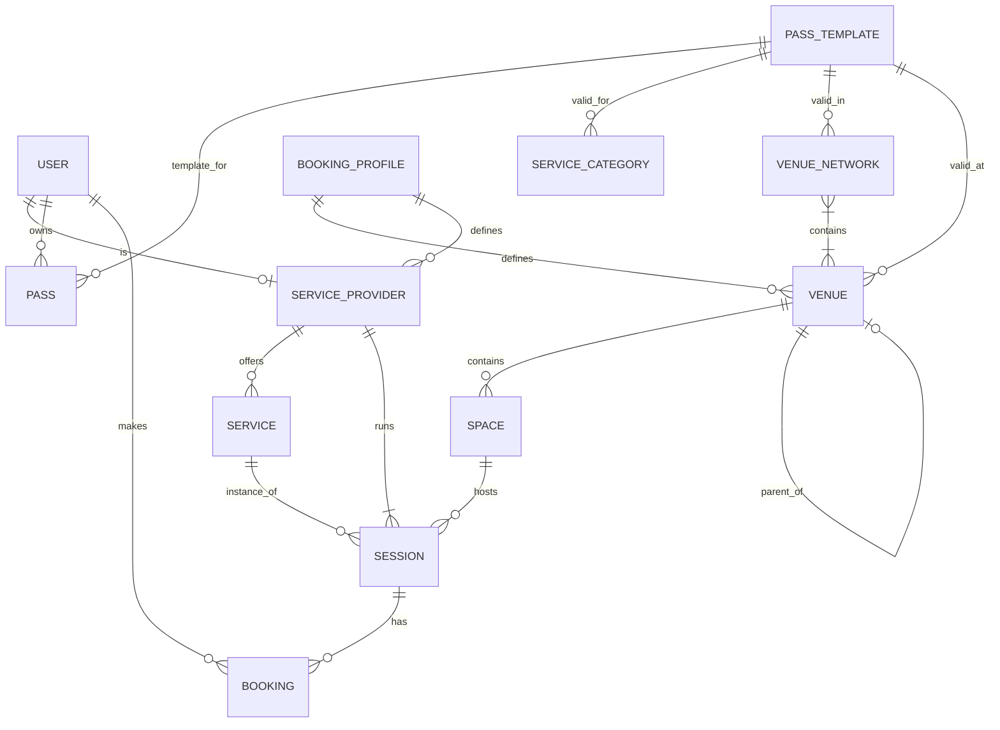
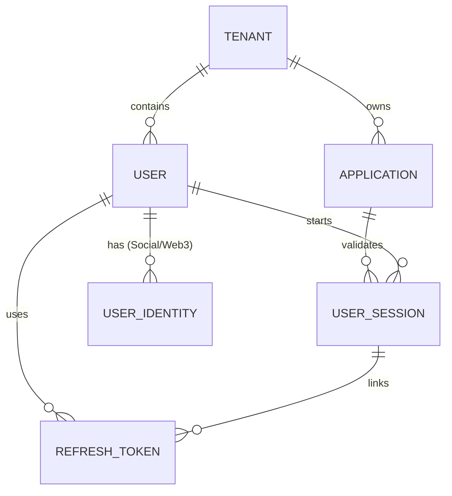

# Data Model Documentation: Node & Federation Matrix

This document describes the data model for the project, focusing on the **Booking Service** (Node & Federation Matrix), the **ZKey Service** (Identity & Multi-tenancy), and the **Vendure Core** (E-commerce).

The system is designed as a distributed architecture where each service manages its own domain while remaining synchronized via shared identifiers (e.g., `zkeyId`, `vendureId`).

## 1. Booking Service: Node & Federation Matrix ERD

## 2. ZKey Service: Identity & Multi-tenancy ERD

---

## 3. Entity Descriptions (Booking Service)

### 🏢 Venue (The "Node")
The fundamental unit of the system. A Venue can represent anything from a physical building to a single business unit or a virtual space.
- **VenueType**:
    - `SITE`: A physical building or address (e.g., "Empire State Building").
    - `UNIT`: A business unit within a site (e.g., "The Yoga Studio on 5th floor").
    - `VIRTUAL`: An online-only presence.
- **Hierarchy**: Uses a parent-child relationship to build vertical structures (Complex -> Studio).
- **Associations**: Linked to one `BookingProfile` (Blueprint) and multiple `VenueNetworks` (Federations).

### 🌐 VenueNetwork (The "Federation")
Horizontal groupings that allow venues to share resources, branding, or pass validity.
- **NetworkType**:
    - `COMPLEX`: Vertical grouping for logical management.
    - `NETWORK`: Standard horizontal group (e.g., a franchise).
    - `FEDERATION`: Ad-hoc partnership for cross-venue access.

### 📋 BookingProfile (The "Blueprint")
Vertical templates that define how a specific industry or business type behaves.
- **Purpose**: Defines default metrics, UI configuration, and branding for its associated Venues and Service Providers.

### 🚪 Space
A physical room or area within a `Venue`.
- **Properties**: Name, Type (room, studio, cowork), and Capacity.
- **SpacePreset**: Reusable templates for creating spaces quickly.

### 🧘 Service & ServiceProvider
- **ServiceProvider**: A professional (Instructor, Therapist, Consultant) linked to a `User`.
- **Service**: The definition of "what" is offered (e.g., "Vinyasa Yoga, 60m").
- **ServiceCategory**: Groups services for pass validity (e.g., "All Yoga Classes").

### 🕒 Session
An instance of a `Service` scheduled at a specific `Time` and `Space`.
- **Provider Multi-tenancy**: High-flexibility session management allows multiple providers for a single session.

### 🎫 Pass & PassTemplate
The access control system, integrated with the Vendure commerce engine.
- **PassType**: `PACK` (credits-based) or `MEMBERSHIP` (unlimited access).
- **Validity Matrix**: Passes can be restricted by `ServiceCategory`, `Venue`, or entire `VenueNetwork`.

### 📅 Booking
The final reservation linking a `User` to a `Session`.
- **Status**: `CONFIRMED`, `CANCELLED`, `WAITLISTED`.
- **Check-in**: Tracks physical attendance.

---

## 4. Entity Descriptions (ZKey Service)

### 🏢 Tenant
The top-level organizational unit. A single platform instance can host multiple Tenants (e.g., Enterprise A, Enterprise B).
- **Integrations**: Stores configuration for 3rd party services.
- **Branding**: Global styles for the login flow.

### 📱 Application
A specific client application (Dashboard, Mobile App, Storefront) belonging to a Tenant.
- **Auth Methods**: Configures which login flows are allowed (Email OTP, SMS, Social).
- **Security**: Manages Redirect URIs, CORS, and Token TTLs.

### 👤 User
The core identity object.
- **Identifiers**:
    - `id`: Internal ZKey ID.
    - `vendureId`: Link to the Vendure customer ID.
    - `walletAddress`: Link to Web3 identity.
- **Roles**: System roles (e.g., `system-admin`, `admin`, `user`).

### 🔑 Identity & Session
- **UserIdentity**: Links a User to a specific provider (Google, GitHub, Wallet).
- **UserSession**: Tracks active OIDC sessions, supporting backchannel logout.

---

## 5. Key Relationships & Business Logic

### Vertical vs. Horizontal
- **Vertical Hierarchy**: `Venue.parentId` allows a Site to contain multiple Units. Units inherit or are governed by the Site's configuration.
- **Horizontal Federation**: `VenueNetwork` allows a "Pass" bought in Venue A to be valid in Venue B, provided they share a Federation.

### Blueprint Governance
The `BookingProfile` acts as a governor. A Venue belonging to the "Yoga Studio" blueprint will present a different dashboard and consumer UI than one belonging to the "Shared Office" blueprint.

### Pass Entitlement Engine
When a user attempts to book a session:
1. The system checks if the session's `Service.category` matches the pass.
2. It checks if the session's `Venue` is directly linked to the pass.
3. It checks if the session's `Venue` belongs to a `VenueNetwork` that is linked to the pass.

---

## 6. E-Commerce Integration (Vendure)

The platform utilizes **Vendure** as its headless commerce engine.

### 🛍️ Products to Passes
- Every `PassTemplate` in the Booking Service can be linked to a `ProductVariant` in Vendure (`vendureProductVariantId`).
- When a customer purchases a specific product, a webhook or sync process triggers the creation of a `Pass` for that user in the Booking Service.

### 💳 Payments
- All financial transactions (Checkout, Payment Processing via Lyra/Stripe) are handled by Vendure.
- The Booking Service only manages the **usage** (credits/duration) of the resulting entitlements.
