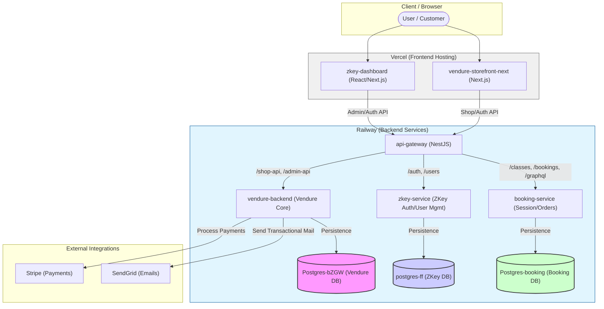

# System Architecture

This diagram describes the system architecture of the MatMax project, as implemented in the codebase.

## High-Level Workflow

## Architectural Highlights
- **Service Isolation**: Each core domain (`Vendure`, `Zkey`, `Booking`) has its own dedicated microservice and independent PostgreSQL database to ensure data integrity and scalability.
- **Unified Gateway**: `api-gateway` (Port 3006) acts as the **sole entry point** for all system interactions. It unifies the Vendure Shop/Admin APIs, ZKey Auth, and Booking Service GraphQL via a single domain.
- **Microservices Communication**: Services are containerized and deployed on Railway, utilizing internal networking for low-latency communication.
